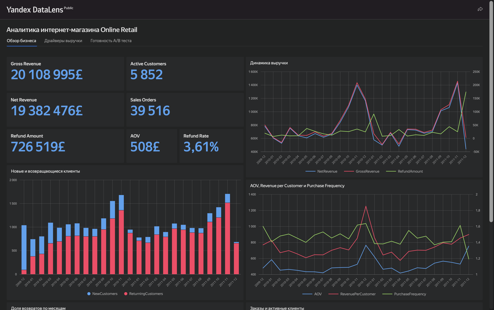
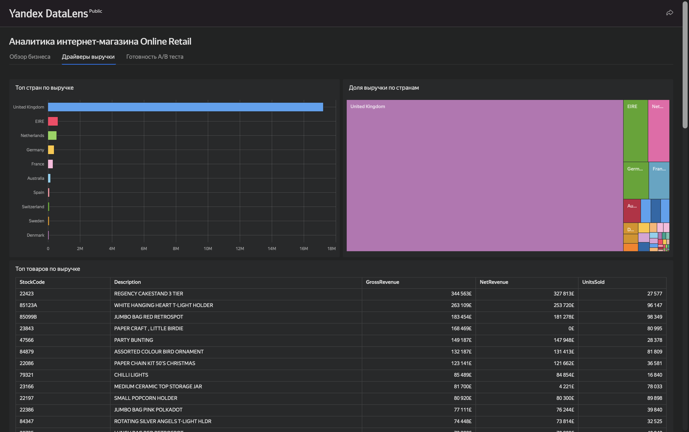
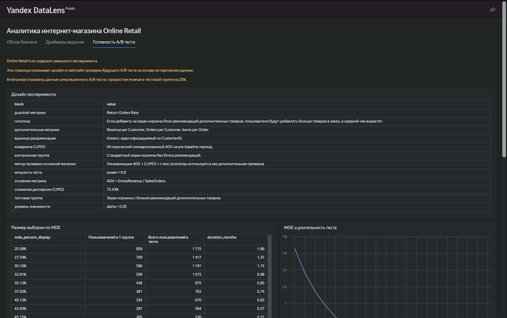

# Online Retail Product Analytics

Портфолио-проект по продуктовой аналитике интернет-магазина на данных **Online Retail II**.

Цель проекта - пройти полный аналитический цикл: очистить транзакционные данные, восстановить бизнес-сущности, посчитать продуктовые метрики, найти точки роста, подготовить дизайн A/B-теста и собрать BI-дашборд для быстрой оценки бизнеса.

## Дашборд

Опубликованный дашборд: [Yandex DataLens](https://datalens.yandex/6k37hs9ketrgq)

Дашборд построен на CSV-агрегатах, подготовленных в ноутбуках. Глобальные селекторы не используются осознанно: данные агрегированы на разных уровнях, поэтому такие фильтры могли бы вводить в заблуждение, скрывая строки в отдельных чартах без полноценного пересчета метрик.







## Что сделано

- Проведен EDA исходных транзакций Online Retail II.
- Очищены данные от технических операций, нулевых цен и складских корректировок.
- Восстановлены сущности заказа, клиента и товара.
- Посчитаны ключевые метрики: revenue, AOV, refund rate, active customers, repeat purchase rate, purchase frequency.
- Подготовлены агрегаты по месяцам, дням, странам, товарам, клиентам и когортам.
- Проведены RFM-сегментация и cohort retention.
- Сформулированы продуктовые выводы и направления роста.
- Спроектирован будущий A/B-тест для блока рекомендаций в корзине.
- Для AOV как ratio-метрики применены линеаризация, CUPED, Welch t-test и bootstrap.
- Собран и опубликован DataLens-дашборд на 3 страницы.

## Ключевые метрики

| Метрика | Значение |
| --- | ---: |
| Gross Revenue | около 20.1M |
| Net Revenue | около 19.4M |
| Sales Orders | около 39.5K |
| Active Customers | около 5.9K |
| AOV | около 509 |
| Refund Rate | около 3.6% |
| Repeat Purchase Rate | около 72% |

## Основные выводы

1. **Бизнес держится на повторных покупках.**
   72,4% активных клиентов покупали два и более раз. Поэтому рост стоит искать не только в привлечении новых клиентов, но и в увеличении частоты покупок, среднего чека и глубины корзины.

2. **Выручка сильно сезонная.**
   Пики заказов и выручки приходятся на октябрь-ноябрь. Закупки, складские остатки и промо-активности нужно готовить заранее, до начала сезонного пика. Декабрь 2011 в датасете неполный, поэтому его нельзя напрямую сравнивать с полными месяцами.

3. **География концентрирована на UK.**
   Великобритания дает около 85,7% gross revenue, а топ-5 стран вместе дают около 95,1%. Основные продуктовые решения и риски бизнеса завязаны на UK-рынок. Из внешних рынков отдельно выделяются Ирландия, Нидерланды, Германия и Франция; Нидерланды выглядят интересно из-за высокой выручки и низкого refund rate.

4. **В товарном портфеле есть и драйверы, и рискованные позиции.**
   Часть товаров стабильно дает выручку за счет большого числа заказов и клиентов. При этом есть позиции с высоким refund rate, которые выглядят сильными по gross revenue, но почти теряют вклад после учета возвратов. Для решений по ассортименту важно смотреть не только gross revenue, но и net revenue, refund rate и число клиентов.

5. **RFM показывает понятные зоны для действий.**
   Сегмент `Champion` дает около 11.9M gross revenue и требует удержания. Клиенты из сегмента `At Risk` уже принесли около 1.64M gross revenue, но давно не покупали, поэтому это хорошая аудитория для реактивации.

6. **Retention подсказывает окно для повторной покупки.**
   После первых месяцев удержание постепенно снижается до диапазона примерно 15-18%, поэтому реактивацию лучше запускать в первые 30-60 дней после покупки.

## A/B-тест

В исходных данных нет настоящего A/B-теста, поэтому экспериментальная часть не интерпретируется как исторический эксперимент. Исторические данные используются для дизайна будущего теста.

Проверяемая гипотеза: **блок рекомендаций в корзине увеличит средний чек**.

Основные параметры:

- unit of randomization: клиент;
- primary metric: `AOV = GrossRevenue / SalesOrders`;
- основной статистический подход: линеаризация AOV + CUPED + Welch t-test;
- дополнительная проверка: bootstrap для сырой AOV;
- guardrail: Return Orders Rate.

На исторических данных CUPED снизил дисперсию линеаризованной AOV примерно на **73%**. В синтетической A/B-симуляции группе B был добавлен uplift к revenue на **25%**; наблюдаемый прирост AOV составил около **21%**. Основной тест показал статистически значимый результат (`p-value ≈ 0.00023`), bootstrap также дал доверительный интервал выше нуля.

## Структура проекта

```text
portfolio-analytics/
├── README.md
├── requirements.txt
├── notebooks/
│   ├── 01_eda.ipynb
│   ├── 02_product_metrics.ipynb
│   └── 03_ab_test.ipynb
├── data/                          # локальные данные и сгенерированные CSV, не коммитятся
│   ├── .gitkeep
│   ├── online_retail_II.csv       # исходный датасет
│   ├── clean_online_retail_II.csv # результат 01_eda
│   ├── aggregates/                # агрегаты из 02_product_metrics
│   │   └── .gitkeep
│   └── ab/                        # агрегаты из 03_ab_test
│       └── .gitkeep
└── bi/
    └── screenshots/
```

Файлы `data/*.csv` и `data/**/*.csv` не добавляются в git: исходный датасет нужно скачать отдельно, а промежуточные и финальные CSV воспроизводятся запуском ноутбуков. Папки внутри `data/` сохранены через `.gitkeep`, чтобы ноутбуки могли сразу писать результаты в ожидаемую структуру.

## Ноутбуки

| Ноутбук | Содержание |
| --- | --- |
| `01_eda.ipynb` | загрузка данных, EDA, очистка, обработка возвратов и технических операций |
| `02_product_metrics.ipynb` | заказы, бизнес-метрики, продуктовые выводы, RFM, cohort retention, CSV-агрегаты |
| `03_ab_test.ipynb` | дизайн A/B-теста, CUPED, MDE, A/A-симуляция, синтетическая A/B-проверка |

## BI-дашборд

Дашборд состоит из трех страниц:

1. **Обзор бизнеса** - KPI, выручка, заказы, клиенты, возвраты.
2. **Драйверы выручки** - страны, товары, RFM-сегменты, retention.
3. **Готовность A/B-теста** - дизайн эксперимента, MDE, sample size, синтетический A/B и guardrail.

## Как воспроизвести

1. Установить зависимости:

```bash
pip install -r requirements.txt
```

2. Поместить исходный файл Online Retail II в:

```text
data/online_retail_II.csv
```

3. Убедиться, что в проекте есть папки `data/aggregates/` и `data/ab/`. В репозитории они уже сохранены через `.gitkeep`.

4. Последовательно запустить ноутбуки:

```text
notebooks/01_eda.ipynb
notebooks/02_product_metrics.ipynb
notebooks/03_ab_test.ipynb
```

## Ограничения данных

- Нет сессий, просмотров и пользователей без покупки, поэтому нельзя честно считать conversion rate и воронку.
- Возвраты нельзя надежно связать с исходными заказами: в данных нет `original_invoice_id`.
- Настоящего A/B-теста в Online Retail II нет, поэтому экспериментальная часть - это дизайн и симуляция будущего теста, а не анализ исторического эксперимента.
- Строки без `Customer ID` используются для общей выручки и заказов, но не используются в RFM, retention и customer-level метриках.
